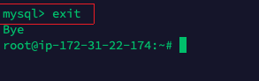
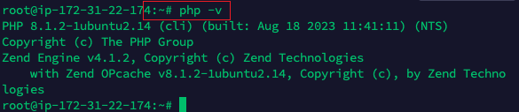

# LAMPPROJECT

Step 0 - Create an instance

Step 1 - Installing Apache and Updating the Firewall

Step 2 -  Installing Mysql

Step 3 - Installing PHP

Step 4 - Creating Virtual Host for the website using Apache

Step 5 - Enable PHP on the website

